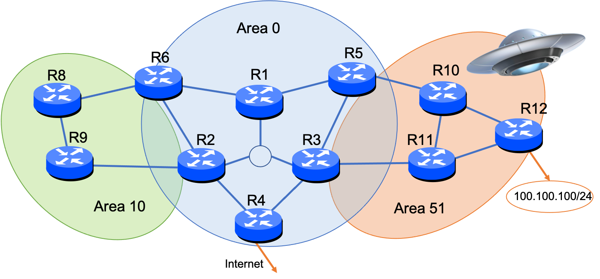

# Practical Lab on OSPF - Part 1: Area 0

## Topology Considered
We will consider the following topology.



The network consists of 11 routers located in three different areas. The backbone area (area 0) contains R1, R2, ... R6. Area 10 contains R2, R6, R8 and R9. And finally Areea 51 contains R10, R11, R12, R3 and R5. Note that we don't why there is no R7, through some people claim that it was abducted by Aliens (when trying to visit Area 51).  

IPv4 Addresses are assigned in a very simple way, for instance router 1 interface connecting to R5 will be 10.0.15.1/24, corresponding to: 10.(area 0).(from r1 to r5).(1 for r1). With the notable exception of subnet 10.0.10.0/24 which is the central LAN containing both R1,R2 and R3. Each router is also configured with a "pseudo" interface: 10.0.0.1 for R1, ..., 10.0.0.6 for R6, 10.10.0.8 for R8, ..., 10.51.0.10 for R10 etc.  These interface-independant addresses are used as OSPF Router IDs. For more details on the addressing plan, see the Appendix at the bottom of this page. 

All the routers are pre-configured with interfaces already configured and OSPF enabled. We'll thus be able to play a little bit with OSPF and observe LSAs, adjacencies, etc. 

In this first part, we shall concentrate on Area 0 (only). 

## Network Tool 

All the routers are in fact small Docker containers running the open-source routing suite "Quagga". They are configured and launched automatically to fit with our desired topology thanks to the "Kathara" tool. In essence, they are interconnected together via virtual Ethernet network (linux bridges). 

### Starting the lab

To start the lab, type:
```bash
cd ~/Lab1-OSPF/ 
sudo kathara lstart --noterminal
```
Something similar to this will be displayed: 
```console 
INFO - ================= Starting Network Scenario =================
INFO - 
Name: OSPF Area 51
Description: INF566 - TP OSPF
Version: 0.1
Author(s): Jean-Louis Rougier
Email: rougier@telecom-paris.fr
Website: https://moodle.polytechnique.fr
INFO - =============================================================
INFO - Installing Kathara Network Plugin...
INFO - Kathara Network Plugin installed successfully!
Deploying collision domains...|###############################################| 15/15
INFO - Pulling image `kathara/quagga:latest`... This may take a while.
Deploying devices...|#########################################################| 11/11
```

Note that it may take a while before the lab becomes available, the first you'll invoke this command, as the Quagga image will have to be fetched from the Internet.  

One 11/11 devices have been deployed, the lab is ready. 
To connect to a virtual router, you can type: 
```bash 
sudo kathara connect r1
```
You'll see that the 'prompt' will change, indicating you're not connected (as root, i.e. superuser) to this device:
```console
cnf-lab> kathara connect r1
root@r1:/# 
```

If latter on you need to exit from this router and go back to the original linux terminal, simply type
```bash
exit
```

*Note*: You can open other terminals with the '+' sign on the upper right of the web page. You could use this feature to connect to different routers simultaneously (connecting to different routers in each terminal). This will avoid connecting and disconnecting from one router to another during the lab. 

*Remark*: More information about kathara can be found [here:](https://www.kathara.org/man-pages/kathara.1.html), 
or just by typing "kathara -h". In a nutshell: 
```console 
kathara  lstart --noterminals : Launch the lab. You need to inside the Lab folder (with the 'lab.conf' file). 
kathara lclean : Allows to stop all the containers of the lab.
kathara wipe : Allows to stop all the containers "brutally" and clean (wipe) everything (all the modifications made in the different containers will be lost).
kathara list : List all the containers.
kathara connect <name> : allow to connect to router <name>. 
```
*Caution*: For all these commands, it is important to be connected in the Lab directory (`~/Lab1-OSPF/`).

### Linux commands 
The containers are equipped with classical linux networking tools. 
First, if needed, connect to one of the router (say r1 here): 
```bash
cd ~/Lab1-OSPF/
kathara connect r1
```
Then to see its different interfaces and associated IP addresses, we can use: 
```
ip addr
```
```console
root@r1:/# ip addr
1: lo: <LOOPBACK,UP,LOWER_UP> mtu 65536 qdisc noqueue state UNKNOWN group default qlen 1000
    link/loopback 00:00:00:00:00:00 brd 00:00:00:00:00:00
    inet 127.0.0.1/8 scope host lo
       valid_lft forever preferred_lft forever
2: dummy0: <BROADCAST,NOARP,UP,LOWER_UP> mtu 1500 qdisc noqueue state UNKNOWN group default qlen 1000
    link/ether da:61:1d:ee:45:91 brd ff:ff:ff:ff:ff:ff
    inet 10.0.0.1/32 brd 10.255.255.255 scope global dummy0
       valid_lft forever preferred_lft forever
20: eth0@if19: <BROADCAST,MULTICAST,UP,LOWER_UP> mtu 1500 qdisc noqueue state UP group default qlen 1000
    link/ether f2:d9:68:8b:e9:9f brd ff:ff:ff:ff:ff:ff link-netnsid 0
    inet 10.0.15.1/24 brd 10.0.15.255 scope global eth0
       valid_lft forever preferred_lft forever
22: eth1@if21: <BROADCAST,MULTICAST,UP,LOWER_UP> mtu 1500 qdisc noqueue state UP group default qlen 1000
    link/ether 82:37:4d:26:ae:c5 brd ff:ff:ff:ff:ff:ff link-netnsid 0
    inet 10.0.16.1/24 brd 10.0.16.255 scope global eth1
       valid_lft forever preferred_lft forever
24: eth2@if23: <BROADCAST,MULTICAST,UP,LOWER_UP> mtu 1500 qdisc noqueue state UP group default qlen 1000
    link/ether 3a:41:46:92:f9:62 brd ff:ff:ff:ff:ff:ff link-netnsid 0
    inet 10.0.10.1/24 brd 10.0.10.255 scope global eth2
       valid_lft forever preferred_lft forever
```
We can see here that router r1 has three main interfaces (eth0,eth1 and eth2) and a special 'dummy0' interface with IP address 10.0.0.1/32. 

Its routing table can be seen with:  
```bash 
ip route
```
```console
root@r1:/# ip route
10.0.0.2 via 10.0.10.2 dev eth2 proto zebra metric 20 
10.0.0.3 via 10.0.10.3 dev eth2 proto zebra metric 20 
10.0.0.4 proto zebra metric 20 
	nexthop via 10.0.10.3 dev eth2 weight 1 
	nexthop via 10.0.10.2 dev eth2 weight 1 
10.0.0.5 via 10.0.15.5 dev eth0 proto zebra metric 20 
10.0.0.6 via 10.0.16.6 dev eth1 proto zebra metric 20 
10.0.10.0/24 dev eth2 proto kernel scope link src 10.0.10.1 
10.0.15.0/24 dev eth0 proto kernel scope link src 10.0.15.1 
10.0.16.0/24 dev eth1 proto kernel scope link src 10.0.16.1 
10.0.24.0/24 via 10.0.10.2 dev eth2 proto zebra metric 20 
10.0.26.0/24 proto zebra metric 20 
	nexthop via 10.0.16.6 dev eth1 weight 1 
	nexthop via 10.0.10.2 dev eth2 weight 1 
10.0.34.0/24 via 10.0.10.3 dev eth2 proto zebra metric 20 
10.0.35.0/24 proto zebra metric 20 
	nexthop via 10.0.15.5 dev eth0 weight 1 
	nexthop via 10.0.10.3 dev eth2 weight 1 
```
The list of IP addresses and network prefixes is enumerated at the end of this lab (section 'Appendix: Addressing Plan'). 

You can test connectivity (to another router) with `ping` and check the paths taken to reach a destination with `traceroute`. Example: 
```bash
traceroute 10.0.0.4
```
```console
traceroute to 10.0.0.4 (10.0.0.4), 30 hops max, 60 byte packets
 1  10.0.10.3 (10.0.10.3)  0.094 ms  0.060 ms  0.047 ms
 2  10.0.0.4 (10.0.0.4)  0.102 ms  0.077 ms  0.054 ms
```
(we reach r4, 10.0.0.4, trough r3, via the central subnet). 


### Quagga

*Quagga* is a well known open-source routing software suite. It consists of a central process (`zebra`) which will allow to manage the relation beetween different routing protocols and the linux kernel (in particular for interface management and to instantiate routes in the linux forwarding table). Then several processes can be launched (one for each protocol): `ospfd`, `bgpd`, ... 
In this lab, only `ospfd` is running (fair enough, it is an OSPF lab...)

*Quagga* also offers a management interface (usually called *CLI: Command Line Interface*, where we type specific commands and get the result, similarly to a command terminal in windows or linux, but with specific router commands). It will be very usefull to monitor OSPF operational data (adjacencies, database) and to configure OSPF.  In order to connect to OSPF CLI, use the command (from a router):
```bash
telnet localhost ospfd  
```
You'll need to enter a password (zebra). 
Note that the prompt has changed to `R1>`. To become super-user (to be able to see more information and to configure the router), type 
``bash
enable 
```
The password is `zebra`once more. You should see the prompt is now `R1#`. 

If you want to exit from ospfd, just type "exit": you'll return back to the terminal of the container (with prompt `root@r1`).  

Note, that except for a few slight differences, the Quagga CLI is very close to the CLI of a well known router manufacturer from the bay area. Here is a list of  the most useful commands. 

You first need to be connected to the appropriate router/container (`kathara connect r1` for example).

To get the list of IP addresses used on the different OSPF interfaces:
```bash
show ip ospf database
```
To look at its configuration:
```bash 
show running-config
```
To see its routing table:
```bash
show ip ospf route
```
*Remark*. As in commercial routers, it is possible to have help on line with Quagga CLI. Type "?" to see the possible commands, or possible arguments or options of a command. For example `show ip ospf database ?` will give you everything that can be shown (related to the OSPF database). This allows you to find many interesting things, so do not hesitate to be curious and explore Guagga commands with `?`. 

Also automatic completion is possible by typing the "<tab>" key ( "->|" or  "↹"  on your keyboard). For instance typing "sh" + <tab> with result in a "show". Using <tab> thus goes faster and avoids making errors while typing commands. 

## Questions
The following questions are in the quiz on moodle. The quiz could be opened simultaneously in another tab in your web browser if you want. 

*Question 1.*: How many LSAs are available in the database (of type *Router* and *Network LSA* in particular) ? 

*Question 2*. Observe the Router LSA generated by R1 with a `sh ip ospf database router 10.0.0.1`.  
You'll see that this router announces 4 links, 1 *stub network* and 3 *transit networks*. 
   For you, why 10.0.0.1/32 is announced as a *stub* and not a *transit* network ? You can also have a look at the configuration of R1 with a `show running-config`, to help you. 

*Question 3*. Observe the Network LSA corresponding to 10.0.10.0/24 ? How many routers are announced in the 'attached router' section ? 

*Question 4*. Note the 'age' of this last LSA. Do you know what is the usual "max age" (maximum age) of an LSA ?  (Note: it can't be found in the router itself... unfortunately, you have to guess or search on the web). 

*Remark*. As you have seen, we have added pseudo interfaces ("dummy0): it is a virtual interface (named also "loopback" interface on some manufacturers). You have probably also seen that there are announced in OSPF (and are thus in the IP routing table of all the nodes within area 0). This is in fact something important. 
Imagine a network monitoring tool. It is regularly geting information on the route (state, number of packets forwarded on each interface, ....). The monitoring tool needs ot be configued with one of the IP address of this equipment (and you should have seen at this stage that the routers have several IP adresses, since they have several interfaces). If we were to use one of the IP address of an interface, then the router would become unreachable when this interface is down... However, if we use a *virtual* interface, independant from any interface, we can keep the connectivity. As long as one interface is available, OSPF will find a route to reach this router. So this is not simply a trick from this lab but a very practical solution ("know-how") for improving reliability, extensively used in production network... In some commercial routers, it is sometimes called "loopback" interfaces (also a virtual interface, independant of any real interface). 

## Appendix: Addressing Plan (for information)

### Router Configurations

```console 
## Area 0
    Interface   IP Addr /Mask       Net#
-R1
    - dummy0    10.0.0.1/32        -
    - eth0      10.0.15.1/24       15
    - eth1      10.0.16.1/24       16
    - eth2      10.0.10.1/24       10
-R2
    -dummy0     10.0.0.2/32        -
    -eth0       10.0.10.2/24       10
    -eth1       10.0.24.2/24       24
    -eth2       10.0.26.2/24       26
    -eth3       10.10.29.2/24      29
-R3
    -dummy0     10.0.0.3/32        -
    -eth0       10.0.10.3/24       10
    -eth1       10.0.34.3/24       34
    -eth2       10.0.35.3/24       35
    -eth3       10.51.113.3/24     113
-R4 
    -dummy0     10.0.0.4/32        -
    -eth0       10.0.24.4/24       24
    -eth1       10.0.34.4/24       34
-R5
    -dummy0     10.0.0.5/32        -
    -eth0       10.0.15.5/24       15
    -eth1       10.0.35.5/24       35
    -eth2       10.51.105.5/24     105
-R6
    -dummy0     10.0.0.6/32        -
    -eth0       10.0.16.6/24       16
    -eth1       10.0.26.6/24       26
    -eth2       10.10.68.6/24      68
```

```console 
## Area 1

    Interface   IP Addr /Mask       Net#
-R8
    - dummy0    10.10.0.8/32        -
    - eth0      10.10.89.8/24       89
    - eth1      10.10.68.8/24       68
-R9
    - dummy0    10.10.0.9/32        -
    - eth0      10.10.89.9/24       89
    - eth1      10.10.29.9/24       29

```

```console 
## Area 2

    Interface   IP Addr /Mask       Net#
-R10
    -dummy0     10.51.0.10/32      -
    -eth0       10.51.105.10/24    105
    -eth1       10.51.101.10/24    101
    -eth2       10.51.102.10/24    102
-R11
    -dummy0     10.51.0.11/32      -
    -eth0       10.51.113.11/24    113
    -eth1       10.51.101.11/24    101
    -eth2       10.51.112.11/24    112
-R12
    -dummy0     10.51.0.12/32      -
    -eth0       10.51.102.12/24    102
    -eth1       10.51.112.12/24    112
```
